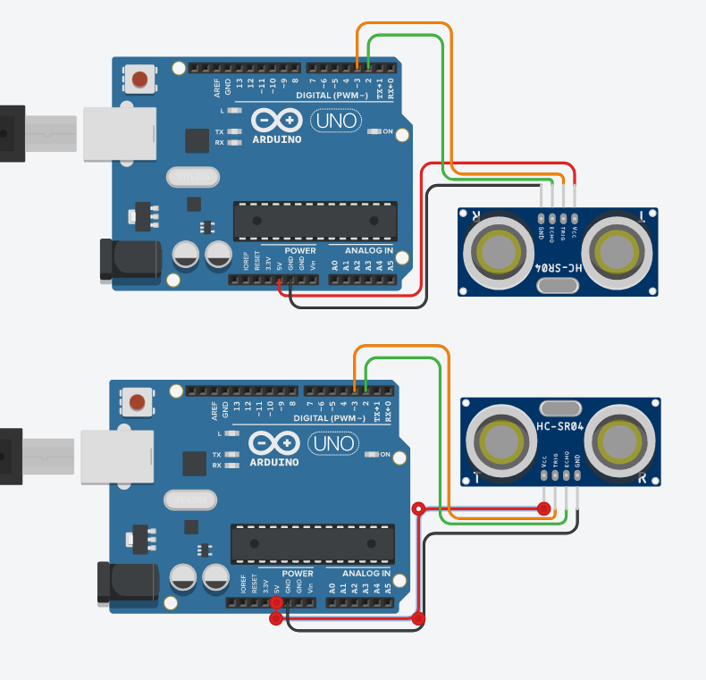
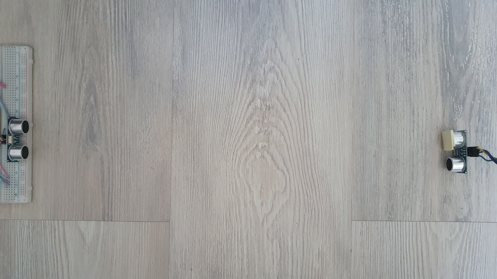
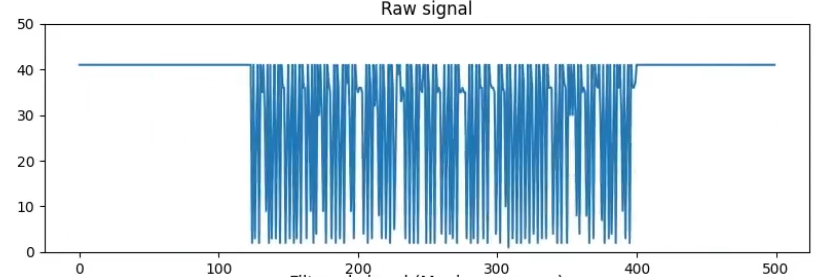
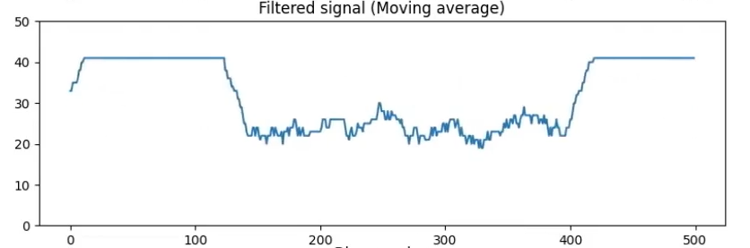
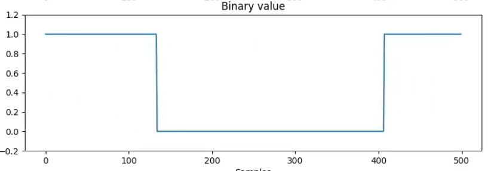

 

    

<h3 align="center">VIN Projekt 2021/22 </h3>
<h2 align="center"> Brezžična komunikacija z ultrazvočnima senzorjema</h2>

    Avtor: Jan Renar, 63200247

    Ljubljana 2022

# Uvod

Cilj projekta je bil omogočiti enosmerno (simplex) brezžično povezavo z uporabo ultrazvočnih tipal HC-SR04. Eno tipalo bo oddajnik, ki bo prek preproste implementacije UART protokola, oddajal podatke v binarni obliki, drugo tipalo pa bo služilo kot sprejemnik, ki bo prejete podatke interpretiral in prikazal. Kot mikrokrmilnik le-teh tipal bom uporabil Arduino.

# Komunikacija
## Preprosta UART implementacija

Komunikacija med napravama je implementirana z preprosto različico UART protokola. V času ko oddajnik ne pošilja podatkov, je na sprejemniku stabilno visoko stanje. Ob začetku oddajanja podatkov, oddajnik najprej pošlje logično vrednost 0, ki nakazuje na UART *START BIT*. Po začetnem bitu se prične pošiljanje podatkov velikosti 8 bitov. Trenutna implementacija programskega dela sprejemnika, teh 8 bitov interpretira kot ASCII znak. Po podatkih sledi paritetni bit (v trenutni implementaciji je vedno nastavljen na 1, sprejemnik pa paritete ne preverja), nato pa še *STOP BIT*, za zaključek UART paketka.

# Komponente in shema

## HC-SR04

HC-SR04 je preprosta različica ultrazvočnih tipal za merjenje razdalje z uporabo ultrazvočnih valov. Sestavljata ga ultrazvočni oddajnik (zvočnik) in sprejemnik (mikrofon). Ti dve komponenti sta zalotani na sprednjem delu tiskanega vezja, na zadnji strani pa so ostale potrebne komponente za delovanje tega tipala. Tipalo razdaljo izmeri tako, da po oddanem ultrazvočnem signalu, meri čas dokler sprejemnik ne zazna odboja in iz izmerjenega časa izračuna prepotovano razdaljo zvočnega valova.

    

# Oddajnik in sprejemnik

Tipala sta postavljena eno nasproti drugemu, kot lahko vidimo na spodnji sliki. Tipalo, ki služi kot oddajnik je na desni strani in ima prekrit sprejemnik. Tipala HC-SR04 delujejo tako, da v primeru, ko tipalo ne prejme povratnega signala (da lahko izmeri razdaljo), po določenem času preneha z meritvijo. Z prekritim sprejemnikom tako dosežemo, da ob vsakem oddajanju, preteče prej omenjeni "timeout", kar nam zagotovi, da tipalo oddaja vedno z enako frekvenco. V nasprotnem primeru, bi bilo število oddajanj/meritev odvisno od razdalje katero merimo (manjša razdalja - hitrejši povratni signal - hitreje pride do naslednje meritve).

Sprejemnik (na levi strani) meritve opravlja kot bi tipalo uporabljali v normalnih okoliščinah (za merjenje razdalje). Tako sprejemnik vedno dobiva pravilno meritev (npr. 50cm - razdalja med tipaloma). To stabilno stanje meritev predstavlja logično vrednost 1. Ob pričetku oddajanja (oddajnika na desni), bo to na meritvah povzročilo veliko šuma in napačnih meritev, katere lahko vidimo na si *Vizualizacija neobdelanega signala*.

Komunikacija je najbolj zanesljiva do razdalje 50cm, saj se na višjih razdaljah pojavi veliko neželenih motenj, kjer bi bilo potrebno bolj napredno filtriranje in procesiranje signala. Tudi hitrost take komunikacije seveda ni bila velika, saj je omejena z občutljivostjo na zunanje motnje, ki se pojavijo v takem sistemu. Najzanesljivejšo komunikacijo sem dosegel z hitrostjo 0.5 bps, oziroma oddajanje enega stanja je trajalo 2 sekundi. Poizkusil sem tudi z manjšimi intervali (1s, 0.5s), vendar se je z tem višalo število nepravilnost in motenj tudi v filtriranem signalu.

    

## Vizualizacija neobdelanega signala

    

## Procesiranje signala

Na tako šumnem signalu ne moremo opraviti vzorčenja z zadovoljivo natančnostjo, zato je potrebno signal naprej obdelati. To sem storil z uporabno krožnega buffer-ja, kamor se vpisujejo vrednosti meritev in na njih se računa drseče povprečje (*Moving Average*). Izled takega signala je razviden na spodnji sliki. Iz takega signala pa veliko lažje vzorčimo in določamo visoka in nizka stanja.

    

## Vzorčenje

Za vzorčenje sem izbral preprost pristop, branje vrednosti drsečega povprečja na vsaki 2 sekundi. Če je bila ta vrednost manjša od prednastavljene konstante, je bila prebrana kot logična vrednost 0, sicer 1.

    

## Posnetek delovanja

https://user-images.githubusercontent.com/23520121/172904258-7ceefc3e-fe4f-4a22-8bf0-594b8d9473f3.mp4

